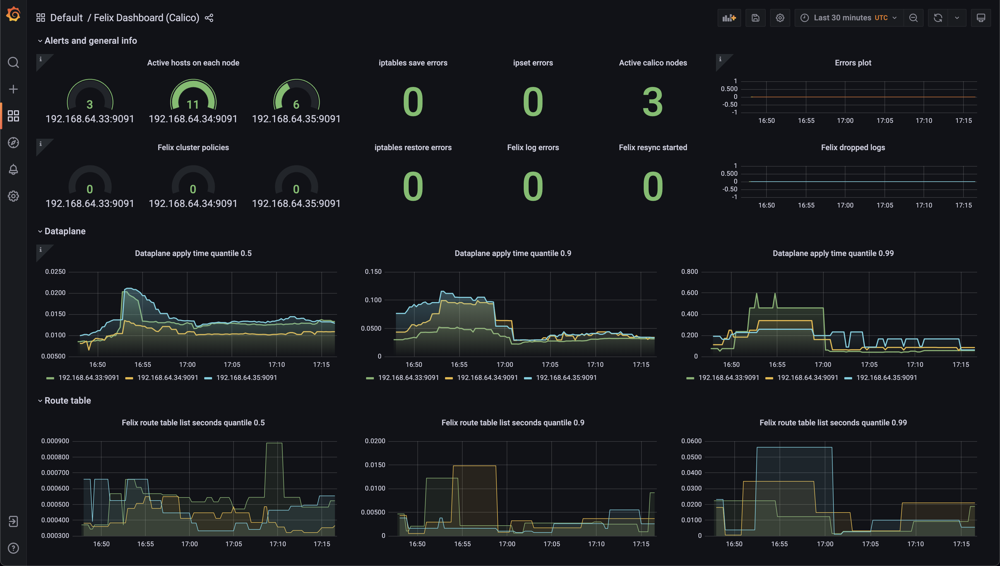
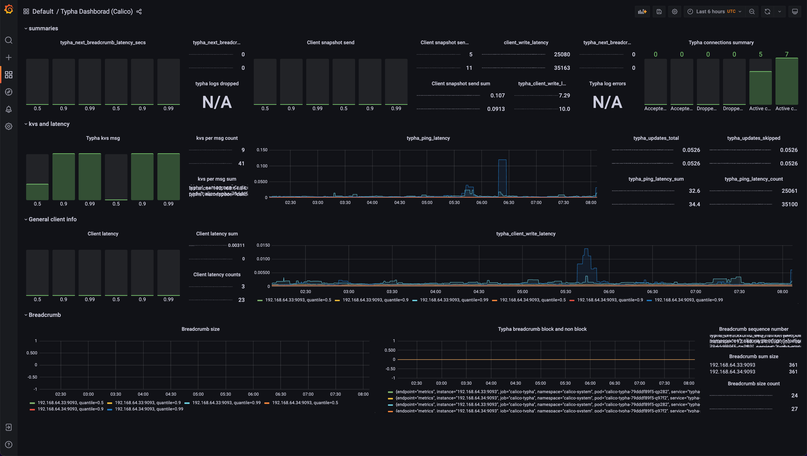

<!-- markdownlint-disable MD033 -->
<h1>
    
    Kubernetes Fury Networking
</h1>
<!-- markdownlint-enable MD033 -->


<!-- <KFD-DOCS> -->

**Kubernetes Fury Networking** implements in-cluster networking functionality for the [Kubernetes Fury Distribution (KFD)][kfd-repo] via Container Network Interface (CNI) plugins.

If you are new to KFD please refer to the [official documentation][kfd-docs] on how to get started with KFD.

## Overview

Kubernetes has adopted the Container Network Interface (CNI) specification for managing network resources on a cluster.

**Kubernetes Fury Networking** makes use of CNCF recommended [Project Calico](https://www.projectcalico.org/), open-source networking and network security solution for containers, virtual machines, and bare-metal workloads, to bring networking features to the Kubernetes Fury Distribution.

Calico deployment consists of a daemon set running on every node (including control-plane nodes) and a controller.

## Packages

Kubernetes Fury Networking provides the following packages:

| Package                    | Version  | Description                                                                                                                                          |
| -------------------------- | -------- | ---------------------------------------------------------------------------------------------------------------------------------------------------- |
| [calico](katalog/calico)   | `3.24.1` | [Calico][calico-page] CNI Plugin. For cluster with `< 50` nodes.                                                                                     |
| [tigera](katalog/tigera)   | `1.28.1` | [Tigera Operator][tigera-page], a Kubernetes Operator for Calico, provides pre-configured installations for on-prem and for EKS in policy-only mode. |
| [ip-masq](katalog/ip-masq) | `2.8.0`  | The `ip-masq-agent` configures iptables rules to implement IP masquerading functionality                                                             |

> The resources in these packages are going to be deployed in `kube-system` namespace. Except for the operator.

Click on each package to see its full documentation.

## Compatibility

| Kubernetes Version |   Compatibility    | Notes           |
| ------------------ | :----------------: | --------------- |
| `1.22.x`           | :white_check_mark: | No known issues |
| `1.23.x`           | :white_check_mark: | No known issues |
| `1.24.x`           | :white_check_mark: | No known issues |

Check the [compatibility matrix][compatibility-matrix] for additional information on previous releases of the module.

## Usage

### Prerequisites

| Tool                        | Version   | Description                                                                                                                                                      |
| --------------------------- | --------- | ---------------------------------------------------------------------------------------------------------------------------------------------------------------- |
| [furyctl][furyctl-repo]     | `>=0.6.0` | The recommended tool to download and manage KFD modules and their packages. To learn more about `furyctl` read the [official documentation][furyctl-repo].       |
| [kustomize][kustomize-repo] | `>=3.5.0` | Packages are customized using `kustomize`. To learn how to create your customization layer with `kustomize`, please refer to their [repository][kustomize-repo]. |

### Deployment

> ⚠️ please notice that the Calico packages is for cluster with less the 50 nodes. If your cluster has more than 50 nodes, you'll need to switch to [Calico + Typha](https://projectcalico.docs.tigera.io/archive/v3.23/getting-started/kubernetes/self-managed-onprem/onpremises#install-calico-with-kubernetes-api-datastore-more-than-50-nodes) or to the [Tigera Operator](katalog/tigera/README.md).

1. List the packages you want to deploy and their version in a `Furyfile.yml`

```yaml
bases:
  - name: networking/calico
    version: "v1.10.0"
```

> See `furyctl` [documentation][furyctl-repo] for additional details about `Furyfile.yml` format.

2. Execute `furyctl vendor -H` to download the packages

3. Inspect the download packages under `./vendor/katalog/networking`.

4. Define a `kustomization.yaml` that includes the `./vendor/katalog/networking` directory as a resource.

```yaml
resources:
  - ./vendor/katalog/networking/calico
```

5. To deploy the packages to your cluster, execute:

```bash
kustomize build . | kubectl apply -f -
```

### Monitoring

The Networking module includes out-of-the-box metrics monitoring and alerting features for its components.

You can monitor the status of the networking stack from the provided Grafana dashboards:

<!-- markdownlint-disable MD033 -->

<a href="docs/images/screenshots/calico-felix-dashboard.png"></a>
<a href="docs/images/screenshots/calico-typha-dashboard.png"></a>

<!-- markdownlint-enable MD033 -->

> click on each screenshot for the full screen version

The following set of alerts is included with the networking module:

| Alert Name                     | Summary                                                                 | Description                                                                                                                       |
| ------------------------------ | ----------------------------------------------------------------------- | --------------------------------------------------------------------------------------------------------------------------------- |
| CalicoDataplaneFailuresHigh    | A high number of dataplane failures within Felix are happening          | Calico node pod {{ $labels.pod }} ({{ $labels.instance }}) has seen {{ $value }} dataplane failures within the last hour          |
| CalicoIpsetErrorsHigh          | A high number of ipset errors within Felix are happening                | Calico node pod {{ $labels.pod }} ({{ $labels.instance }}) has seen {{ $value }} ipset errors within the last hour                |
| CalicoIptableSaveErrorsHigh    | A high number of iptable save errors within Felix are happening         | Calico node pod {{ $labels.pod }} ({{ $labels.instance }}) has seen {{ $value }} iptable save errors within the last hour         |
| CalicoIptableRestoreErrorsHigh | A high number of iptable restore errors within Felix are happening      | Calico node pod {{ $labels.pod }} ({{ $labels.instance }}) has seen {{ $value }} iptable restore errors within the last hour      |
| CalicoErrorsWhileLoggingHigh   | A high number of errors within Felix while loggging are happening       | Calico node pod {{ $labels.pod }} ({{ $labels.instance }}) has seen {{ $value }} errors while logging within the last ten minutes |
| TyphaPingLatency               | Typha Round-trip ping latency to client (cluster {{ $labels.cluster }}) | Typha latency is growing (ping operations > 100ms). VALUE = {{ $value }}. LABELS = {{ $labels }}                                  |
| TyphaClientWriteLatency        | Typha unusual write latency (instance {{ $labels.cluster }})            | Typha client latency is growing (write operations > 100ms). VALUE = {{ $value }}. LABELS = {{ $labels }}                          |
| TyphaErrorsWhileLoggingHigh    | A high number of errors within Typha while loggging are happening       | Typha pod {{ $labels.pod }} ({{ $labels.instance }}) has seen {{ $value }} errors while logging within the last ten minutes       |

<!-- Links -->

[calico-page]: https://github.com/projectcalico/calico
[tigera-page]: https://github.com/projectcalico/calico
[kfd-repo]: https://github.com/sighupio/fury-distribution
[furyctl-repo]: https://github.com/sighupio/furyctl
[kustomize-repo]: https://github.com/kubernetes-sigs/kustomize
[kfd-docs]: https://docs.kubernetesfury.com/docs/distribution/
[compatibility-matrix]: https://github.com/sighupio/fury-kubernetes-networking/blob/master/docs/COMPATIBILITY_MATRIX.md

<!-- </KFD-DOCS> -->

<!-- <FOOTER> -->

## Contributing

Before contributing, please read first the [Contributing Guidelines](docs/CONTRIBUTING.md).

### Reporting Issues

In case you experience any problems with the module, please [open a new issue](https://github.com/sighupio/fury-kubernetes-networking/issues/new/choose).

## License

This module is open-source and it's released under the following [LICENSE](LICENSE)

<!-- </FOOTER> -->
